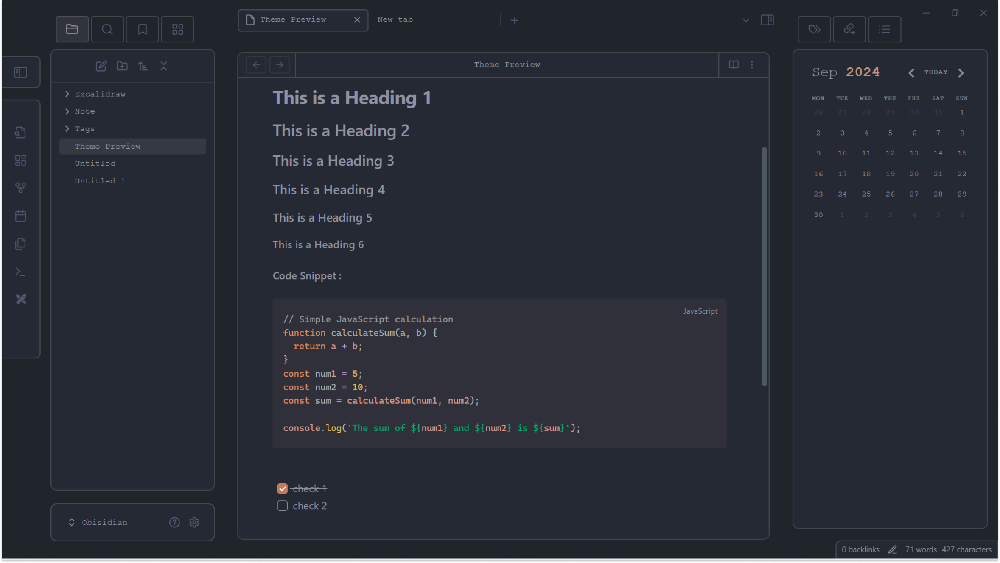

# Obsidian-Minimal-Edge

A sleek and minimalist Obsidian theme designed for those who appreciate clean lines and a focused workspace.

## Installation 

- Open Settings 
- Go to the Appearance section.
- Click Manage next to Themes.
- Search for "Minimal Edge" and select "Install and use"

  
## Support 

If you enjoy my work, please consider supporting me.

## Feedback

If you have any issues or suggestions, please  [submit an issue](https://github.com/Elhary/Obsidian-Minimal-Edge/issues) or raise a  [pull request](https://github.com/Elhary/Obsidian-Minimal-Edge/pulls).

