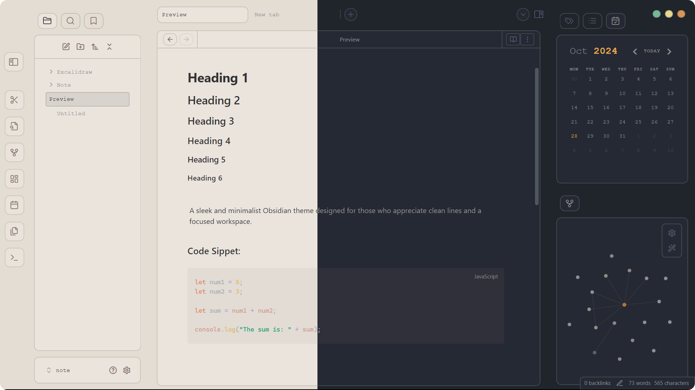

# Obsidian-Minimal-Edge

A sleek and minimalist Obsidian theme designed for those who appreciate clean lines and a focused workspace.

If you like my work, feel free to support me by clicking the icons below!

---

## Style Settings

It is highly recommended to install the Style Settings plugin, which allows you to change the theme and customize various settings. Please note that this is still in development.

## Installation 

- Open Settings 
- Go to the Appearance section.
- Click Manage next to Themes.
- Search for "Minimal Edge" and select "Install and use"

  
## Feedback

If you have any issues or suggestions, please  [submit an issue](https://github.com/Elhary/Obsidian-Minimal-Edge/issues) or raise a  [pull request](https://github.com/Elhary/Obsidian-Minimal-Edge/pulls).

